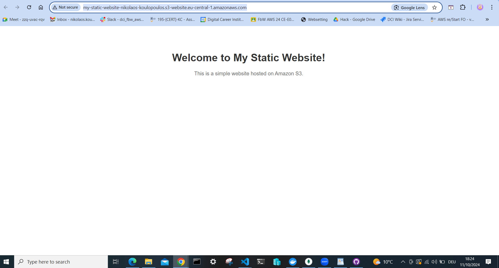

# Static Website Hosting on Amazon S3

This project demonstrates how to host a simple static website using Amazon S3. The website consists of basic HTML and CSS files.

## Features

- **Amazon S3**: Stores and serves the website files.
- **Public Access Configuration**: Allows the website to be accessible to the public.
- **(Optional) Custom Domain and HTTPS**: Secures the website with a custom domain and SSL certificate.

## Setup Instructions

1. **Create an S3 Bucket**: Configure it for static website hosting.
2. **Upload Website Files**: Add `index.html` and other assets.
3. **Set Bucket Policy**: Allow public read access.
4. **Access the Website**: Use the S3 endpoint URL.

## Live Demo

[Access the website here](http://my-static-website-nikolaos-koulopoulos.s3-website.eu-central-1.amazonaws.com/)

## Screenshots

